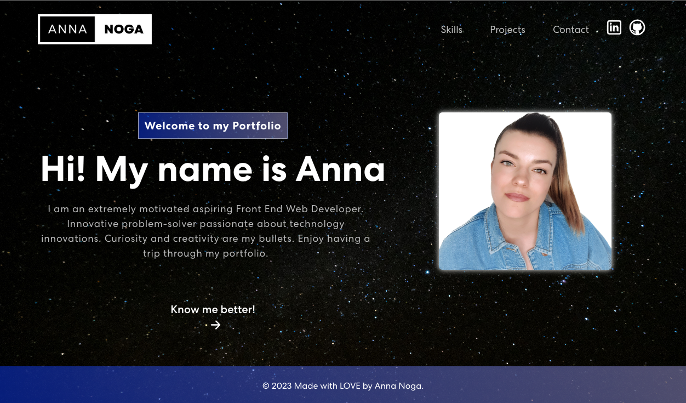

# Anna REACT Portfolio

 

## Table of Contents
  * [Description](#description)
  * [Tools](#tools)
  * [Usage](#usage)
  * [Contributing](#contributing)
  * [Demo](#demo)
  * [Contact](#contact)
  * [License](#license)
  * [Credits](#credits)

## Description
Welcome to my fresh portfolio created with React.js, where you can find some information of myself, check out my recent projects and sofware development skills I present at the moment. You can also contact me directly and jump into my LinkedIn or GitHub profiles to connect with me in there. 

[Portfolio](https://mrsannanoga.github.io/anna-react-portfolio) is live and enable to view online.

## Tools
 

 

## Usage
Presented portfolio webpage includes a navigation bar on the top of webpage to easily navigate information. After clicking on one component of your choice, the UI opens up the chosen section. Under the "Skills" section, you can find all my tech skills I currently present, also my CV is ready to view and download at the bottom of the page. Under the "Projects" section, there are six projects available to view by entering the GitHub or deployment button. These buttons will take you to GitHub or deployed webpage in the new tab. Under the "Contact" section, there is an email form ready to send me a direct message. Webpage is also available to view on any devices like smartphones or tablets.

## Contributing
N\A
      
## Demo

## Contact
You can reach me on:  
[Email](mailto:mrs.anna.noga@gmail.com)  
[GitHub](https://github.com/mrsannanoga) 

## License
MIT 

## Author
Anna Noga
  